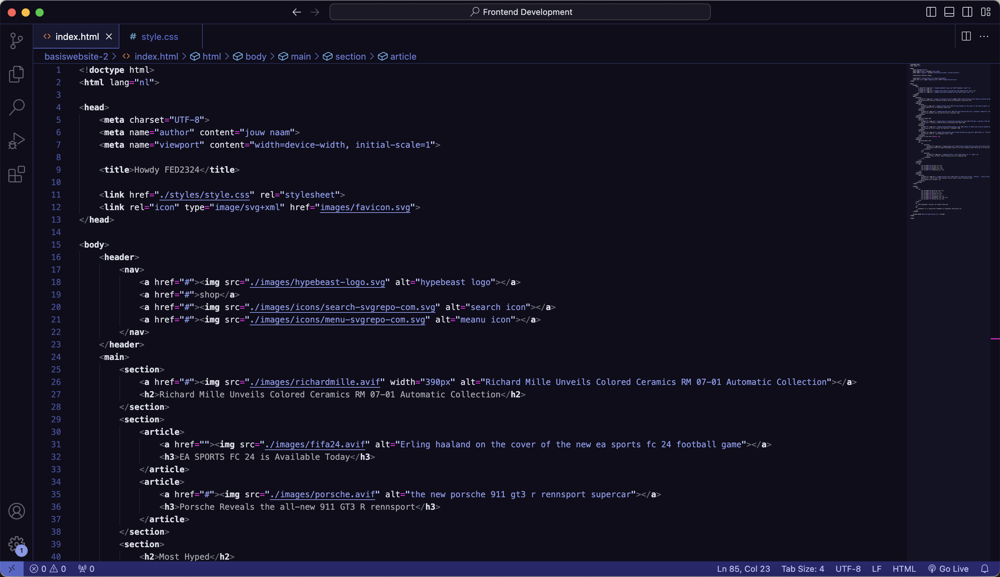
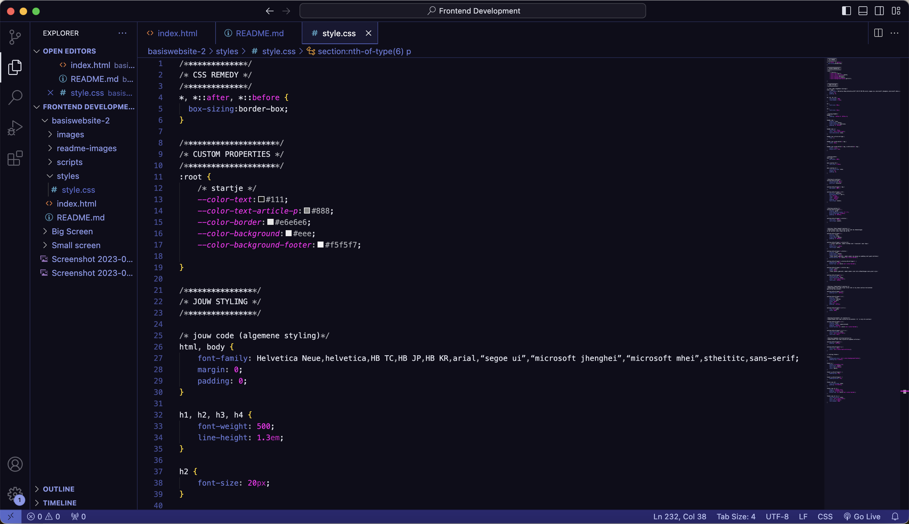
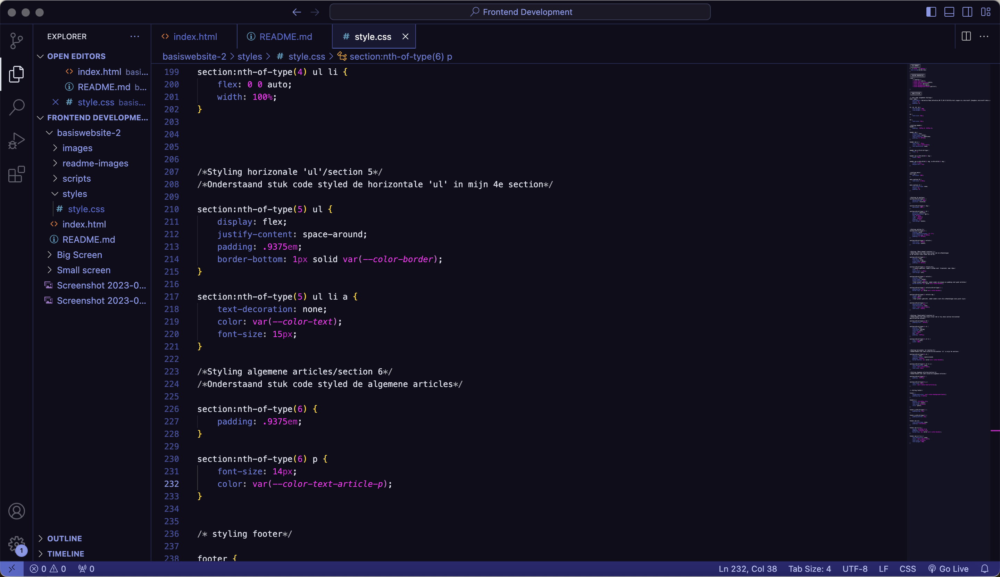

# Procesverslag
Markdown is een simpele manier om HTML te schrijven.  
Markdown cheat cheet: [Hulp bij het schrijven van Markdown](https://github.com/adam-p/markdown-here/wiki/Markdown-Cheatsheet).

Nb. De standaardstructuur en de spartaanse opmaak van de README.md zijn helemaal prima. Het gaat om de inhoud van je procesverslag. Besteedt de tijd voor pracht en praal aan je website.

Nb. Door *open* toe te voegen aan een *details* element kun je deze standaard open zetten. Fijn om dat steeds voor de relevante stuk(ken) te doen.

## Jij

  
uitwerken voor kick-off werkgroep

  ### Auteur:
  Malik van Samson

  #### Je startniveau:
  Blauwe piste

  #### Je focus:
  Responsive 
 

## Je website

  
uitwerken voor kick-off werkgroep

  ### Je opdracht:
  https://hypebeast.com

  #### Screenshot(s) van de eerste pagina (small screen): 
  Homepagina  
  
  
  
  

  #### Screenshot(s) van de tweede pagina (small screen):
  artikelpagina
  
 

## Toegankelijkheidstest 1/2 (week 1)

  
uitwerken na test in 2e werkgroep

  ### Bevindingen
  Lijst met je bevindingen die in de test naar voren kwamen:

## Breakdownschets (week 1)

  
uitwerken na afloop 3e werkgroep

  ### de hele pagina: 
  

  ### dynamisch deel (bijv menu): 
  

  ### wellicht nog een dynamisch deel (bijv filter): 
  

## Voortgang 1 (week 2)

  
uitwerken voor 1e voortgang

  ### Stand van zaken
  Deze week heb ik niet veel tijd besteed aan de html van mijn website. Kan zijn dat dit niet of niet gedetailleerd genoeg uitgewerkt is. Screenschots van mijn website en code volgen nog. (neem ook screenshots op van delen van je website en code)

  ### Agenda voor meeting
  samen met je groepje opstellen

  | Malik          | Jaouad             | Chloé        | Donna            |
  | ---            | ---                | ---          | ---              |
  | ...            | ...                | ...          | ...              |
  | ...            | ...                | ...          | ...              |
  | ...            | ...                | ...          | ...              |
  | ...            | ...                | ...          | ...              |

  ### Agenda punten van meeting

  ### Malik
  - Hoe moet ik een hamburger menu uitwerken in HTML?
  - Wanneer bepaal je of iets een H2, H3 of P is?
  - Hoe krijg ik advertenties op mijn pagina?

  ### Jaouad
  - Onduidelijkheid hoe ik een stuk van een bepaald deel van de content in moet delen in html.
  - Vraag of iets een P of H3 is?
  - Hulp nodig bij de media querries! Waar begin je?

  ### Chloé
  - Opmaak van menu zou ik in html zetten?
  - Hoe kan ik van een h3 een link maken die niet linkt naar een pagina?
  - Hoe kan ik de li juist aanspreken om flexbasis en flexgrow toe te passen?

  ### Donna
  - Hoe laat je een menu eruit als je erop klikt?

  ### Verslag van meeting
  In eerste instantie dacht ik dat we als groep al veel meer gedaan moesten hebben dan alleen de basis HTML, ik dacht namelijk dat er ook al een gedeelte styling gedaan moest zijn.

  Ik liep dus toch goed op schema, de html van mijn eerste pagina was in orde.

  - punt 1
  - punt 2
  - nog een punt
  - ...

## Voortgang 2 (week 3)

  
uitwerken voor 2e voortgang

  ### Stand van zaken
  HTML: Een groot gedeelte van mijn HTML is al bekeken door student-assistenten in de werkgroep van dinsdag 3 oktober. De reacties op mijn HTML waren positief, er waren slechts een aantal verbeterpunten m.b.t. specificering van mijn code.

  CSS: Qua CSS heb ik aardig mijn weg kunnen vinden, om hopelijk mijn gekozen website zo veel mogelijk op het origineel te laten lijken (uiteraard met een betere code overall). 
  
  Mijn vragen m.b.t. headings, menu's en advertenties zijn beantwoord. Headings blijven voor mijn pagina een vraagpunt, omdat er veel verschillende kopjes te vinden zijn. Met het hamburger menu ga ik de aankomende week aan de slag, voor de advertenties zullen er dummie foto's gebruikt worden.

  Onderstaande afbeeldingen zijn foto's van mijn code op dit moment:

  HTML:
  
  
  

  CSS:
  
  
  
  
  
  
  

  ### Agenda punten van meeting

  ### Malik
  - Hoe zorg ik ervoor dat mijn gehele pagina, op uitzondering van één element dezelfde padding krijgt?
  - Hoe zorg ik ervoor dat EM juist wordt vertaald naar PX?

  ### Jaouad
  - Loop helemaal vast met CSS.
  - Zijwaarts scrollen voorkomen.
  - Positionering van content.
  - Custom font pakt hij niet.
  - Afbeeldingen sizen naar section/grid?
  - Position absolute/relative gaat niet goed.

  ### Chloé
  - Hoe zorg ik ervoor dat mijn <form> de juiste grote is aan de hand van grid?

  ### Donna
  - 

  ### Verslag van meeting
  *hier invullen

  - punt 1
  - punt 2
  - nog een punt
- ...

## Toegankelijkheidstest 2/2 (week 4)

  
uitwerken na test in 9e werkgroep

  ### Bevindingen
  Lijst met je bevindingen die in de test naar voren kwamen (geef ook aan wat er verbeterd is):

## Voortgang 3 (week 4)

  
uitwerken voor 3e voortgang

  ### Stand van zaken
  hier dit ging goed & dit was lastig (neem ook screenshots op van delen van je website en code)

  ### Agenda voor meeting
  samen met je groepje opstellen

  | student 1      | student 2          | student 3    | student 4        |
  | ---            | ---                | ---          | ---              |
  | dit bespreken  | en dit             | en ik dit    | en dan ik dat    |
  | en dat ook nog | dit als er tijd is | nog een punt | dit wil ik zeker |
  | ...            | ...                | ...          | ...              |

  ### Verslag van meeting
  hier na afloop snel de uitkomsten van de meeting vastleggen

  - punt 1
  - punt 2
  - nog een punt
  - ...

## Eindgesprek (week 5)

  
uitwerken voor eindgesprek

  ### Je uitkomst - karakteristiek screenshots:
  

  ### Dit ging goed/Heb ik geleerd: 
  Korte omschrijving met plaatjes

  

  ### Dit was lastig/Is niet gelukt:
  Korte omschrijving met plaatjes

  

## Bronnenlijst

  
continu bijhouden terwijl je werkt

  Nb. Wees specifiek ('css-tricks' als bron is bijv. niet specifiek genoeg). 
  Nb. ChatGpT en andere AI horen er ook bij.
  Nb. Vermeld de bronnen ook in je code.

  1. bron 1
  2. bron 2
  3. ...

